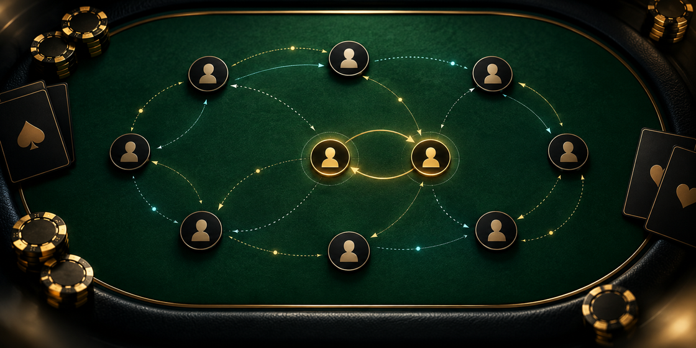

# From Poker Actions to Suspicious Pair Evidence



This repository is the public verification package for the selected entries in **Detect Suspicious Value Transfers in Poker**. It contains the executable notebook, deterministic submission builder, frozen public artifacts, integrity manifest, modeling documentation, and five evidence case reviews.

The two selected files are generated in a clean environment and checked byte for byte:

| Selected entry | Kaggle submission ID | Rows | SHA-256 |
|---|---:|---:|---|
| v53 | 56391641 | 112,540 | `3991740457962e77d38a43859d00e2c31dbbbbd3a01d06946ff99f10d98fadd4` |
| v51 | 56354264 | 112,540 | `c8b0f4c260f7766366ab2060bdc91849d24f0bd44d9dcf35c63c02fff582e370` |

## Reproduce the selected files

Python 3.11 or newer is sufficient. No network access and no third-party package are needed for the exact replay.

```bash
python scripts/reproduce.py --artifact-dir artifacts --output-dir outputs
```

The command writes `outputs/submission_v53.csv`, `outputs/submission_v51.csv`, and `outputs/reproduction_report.json`. It refuses to complete if the schema, row count, unique pair count, evidence structure, source hash, or output hash differs from the audited manifest.

Windows users can also run:

```powershell
.\reproduce.ps1
```

Linux and macOS users can run:

```bash
./reproduce.sh
```

## What the notebook contains

[`notebooks/from_poker_actions_to_suspicious_pair_evidence.ipynb`](notebooks/from_poker_actions_to_suspicious_pair_evidence.ipynb) keeps the complete explanation and the exact replay in one place:

1. data inventory and exploratory analysis;
2. leakage controls and player-pool validation;
3. preprocessing and symmetric pair-hand feature construction;
4. hand-level detector, pair-level risk/behavior models, and evidence rankers;
5. inference, conservative rank fusion, and submission post-processing;
6. exact v53/v51 generation with SHA-256 verification;
7. five action-grounded case reviews and benign alternatives.

The historical research path generated about 19 GB of intermediate arrays during feature extraction, cross-fitting, equity simulation, and ranking. Those caches are derived data rather than required source material. The selected CSVs are reproduced from a frozen v50 base and two sparse deterministic deltas, while the notebook and `historical_pipeline/` expose the training and inference design that produced those artifacts. This distinction is stated directly so reviewers can separate exact artifact reproduction from a fresh model refit.

For a fresh compact refit from raw competition tables, run `run_reference_refit` from [`src/poker_coordination/raw_pipeline.py`](src/poker_coordination/raw_pipeline.py) after placing the raw files in `../data` (or mounting them in a notebook). It performs feature generation, weak evidence labeling, pair risk/behavior training, hand evidence scoring, stable top-five selection, and CSV validation. The notebook leaves `RUN_REFERENCE_REFIT = False` by default so exact artifact replay remains fast and deterministic; setting it to `True` runs the full raw-to-submission path.

## Repository map

| Path | Purpose |
|---|---|
| `artifacts/` | Frozen v50 base, sparse v51/v53 deltas, and hash manifest |
| `src/poker_coordination/` | Reproduction, validation, complete raw feature/training/inference path, and evidence utilities |
| `historical_pipeline/` | Curated production source and frozen configuration records |
| `notebooks/` | Public Kaggle notebook source |
| `docs/` | Data card, model card, compliance notes, and case reviews |
| `.github/workflows/` | Clean Ubuntu replay and hash verification |

## Method at a glance

Only poker activity is used. Player IDs act as join keys and group boundaries, never as predictive features. The production stack converts hands, seats, and actions into symmetric pair-hand features; cross-fits a hand-event detector; aggregates event signals into pair features; predicts risk and behavior; then ranks five shared hands per pair with family-specific ranking models. Final variants make narrow, predeclared changes to evidence ordering or risk while preserving the rest of the selected base.

Validation holds out connected player pools and tests shortened and chronological histories. Released evidence lists are incomplete and capped, so unlisted hands from positive pairs are not treated as certain negatives. The validation reports are stress tests, not guarantees of hidden leaderboard rank.

## Integrity and scope

- No private leaderboard data, undisclosed labels, player-ID formatting, row order, file order, or generator internals are used.
- The competition logs are synthetic and anonymized. The method still relies only on observable poker activity.
- Evidence hands support human review; they do not prove intent.
- Code is MIT licensed. Competition-derived artifacts remain subject to the competition rules described in the data card.

See [`docs/COMPETITION_COMPLIANCE.md`](docs/COMPETITION_COMPLIANCE.md) for the verification checklist and [`docs/CASE_REVIEWS.md`](docs/CASE_REVIEWS.md) for the five required reviews.
